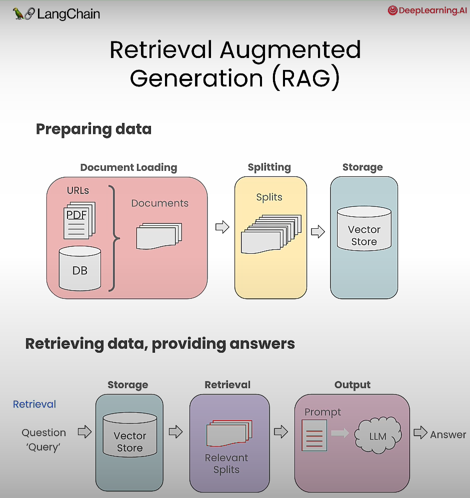

This is a practice repository for course *build LLMs with langchain.js* offered by [deeplearning.ai](deeplearning.ai)
## Language model
1. Text LLMs: string -> string
2. Chat models: list of messages -> single message output

## Prompt Template
Prompt templates help to translate user input and parameters into instructions for a language model. This can be used to guide a model's response, helping it understand the context and generate relevant and coherent language-based output.

There are a few different types of prompt templates:
1. String PromptTemplates
2. ChatPromptTemplates

## LangChain Expression Language (LCEL)

LangChain Expression Language, or LCEL, is a declarative way to easily compose chains together.

### Langchain runnable:
A LangChain runnable is a protocol that allows you to create and invoke custom chains. It's designed to sequence tasks, taking the output of one call and feeding it as input to the next, making it suitable for straightforward, linear tasks where each step directly builds upon the previous one.

- for further reading refer to [langchain-expression-language](https://js.langchain.com/v0.2/docs/concepts#langchain-expression-language)

We can pipe multiple operation using pipe method for runnable sequences.

This is a standard interface, which makes it easy to define custom chains as well as invoke them in a standard way. The standard interface includes:
  - **stream**: stream back chunks of the response
  - **invoke**: call the chain on an input
  - **batch**: call the chain on an array of inputs

## RAG (Retrieval Augmented Generation)

source: [build LLMS with langchain.js](https://learn.deeplearning.ai/courses/build-llm-apps-with-langchain-js/lesson/1/introduction)

we can load different types of documents including pdfs and those available online like Github repository using GithubRepoLoader, figma, azure blob and many more.

### `RecursiveCharacterTextSplitter` 
This text splitter is the recommended one for generic text. It tries to split list of characters in order until the chunks are small enough. The default list of separators is ["\n\n", "\n", " ", ""]. This has the effect of trying to keep all paragraphs (and then sentences, and then words) together as long as possible, as those would generically seem to be the strongest semantically related pieces of text.

Important parameters to know here are chunkSize and chunkOverlap. chunkSize controls the max size (in terms of number of characters) of the final documents. chunkOverlap specifies how much overlap there should be between chunks. This is often helpful to make sure that the text isn't split weirdly.

## Vector Stores
A vector store is a specialized type of  database with natural language search capabilities. 

In AI, vectors are mathematical points that represents data in a format that is understandable by AI algorithms. Vectors are lists (or arrays) of numbers where each number represents a specific feature or attribute of the data. They are stored in vector stores and are used in vector databases. learn more [basics - vector stores](https://www.mongodb.com/resources/basics/vector-stores)
